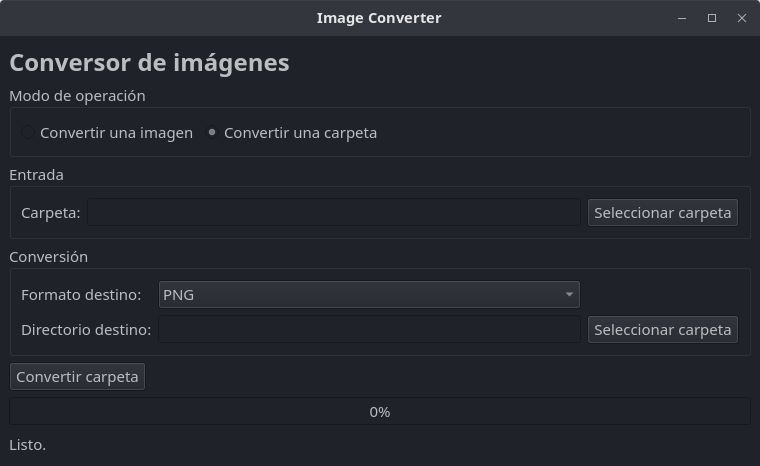

# Image Converter

Aplicación de escritorio desarrollada en **Python + PyQt6 + Pillow** para convertir imágenes entre diferentes formatos.

La aplicación cuenta con dos modos de operación:

1. **Convertir una imagen:** permite seleccionar una imagen individual y convertirla a otro formato.
2. **Convertir una carpeta:** permite seleccionar una carpeta completa y convertir todas las imágenes compatibles que contiene.

---

## 1. Características principales

- Interfaz gráfica de usuario mediante **PyQt6**.
- Conversión de imágenes mediante **Pillow**.
- Conversión individual de imágenes.
- Conversión de carpetas completas.
- Barra de progreso durante la conversión por lotes.
- Indicador del archivo que se está procesando.
- Conteo de imágenes convertidas y errores.
- Selección independiente del directorio de destino.
- Creación automática de un entorno virtual Python (`.venv`).
- Detección automática de librerías Python faltantes.
- Instalación automática de las dependencias Python dentro del entorno virtual.
- Evita modificar las librerías del Python del sistema.
- Compatible con los formatos:
  - PNG
  - JPEG / JPG
  - WEBP
  - BMP
  - TIFF

---

# 2. Requisitos del sistema

## 2.1 Sistema operativo

La aplicación está diseñada principalmente para sistemas Linux, especialmente distribuciones basadas en Debian/Ubuntu.

También puede ejecutarse en otros sistemas que dispongan de:

- Python 3.
- PyQt6 compatible con la versión de Python utilizada.
- Pillow compatible con la versión de Python utilizada.
- Un entorno gráfico compatible con Qt.

---

## 2.2 Python

Se recomienda utilizar:

```text
Python 3.10 o superior
```

La aplicación no instala Python automáticamente. Python debe estar instalado previamente en el sistema.

Para comprobar la versión:

```bash
python3 --version
```

Ejemplo:

```text
Python 3.12.x
```

---

# 3. Dependencias Python

La aplicación utiliza las siguientes librerías Python:

| Librería | Paquete PyPI | Versión |
|---|---|---|
| PyQt6 | `PyQt6` | `6.9.1` |
| Pillow | `Pillow` | `11.3.0` |

> **Nota:** Las versiones indicadas corresponden a las versiones con las que se preparó esta versión de la aplicación. Si se desea reproducibilidad estricta del experimento, se recomienda fijar estas versiones en lugar de instalar versiones más recientes automáticamente.

Las librerías se instalan dentro del entorno virtual `.venv` y no directamente sobre el Python del sistema.

---

# 4. Creación automática del entorno virtual

La aplicación incorpora un mecanismo de **bootstrap** que comprueba si se está ejecutando dentro de un entorno virtual.

Cuando se ejecuta por primera vez:

```bash
python3 image_converter_v3.py
```

la aplicación comprueba si existe:

```text
.venv/
```

en el mismo directorio donde se encuentra el programa.

Si no existe, intenta crearlo mediante:

```bash
python3 -m venv .venv
```

La estructura resultante será aproximadamente:

```text
Image Converter/
├── image_converter.py
├── README.md
└── .venv/
    ├── bin/
    ├── include/
    ├── lib/
    └── pyvenv.cfg
```

En Windows, la ubicación del ejecutable del entorno virtual será:

```text
.venv\Scripts\python.exe
```

mientras que en Linux/macOS será:

```text
.venv/bin/python
```

---

# 5. Instalación automática de las librerías

Una vez creado el entorno virtual, el programa comprueba individualmente las dependencias necesarias.

Internamente se comprueba:

```python
import PyQt6
```

y:

```python
import PIL
```

Si alguna dependencia no está instalada, el programa ejecuta `pip` utilizando específicamente el Python del entorno virtual.

Por ejemplo:

```bash
.venv/bin/python -m pip install PyQt6
```

o:

```bash
.venv/bin/python -m pip install Pillow
```

De esta forma, las dependencias quedan aisladas dentro de:

```text
.venv/
```

y no se modifica el Python global del sistema.

---

# 6. Dependencias del sistema operativo

Las dependencias Python anteriores **no son las únicas necesarias**.

PyQt6 utiliza Qt, y Qt necesita determinadas bibliotecas nativas del sistema operativo para poder crear la interfaz gráfica.

En Linux con X11, una de las dependencias importantes es:

```text
libxcb-cursor0
```

En Ubuntu/Debian puede instalarse mediante:

```bash
sudo apt update
sudo apt install libxcb-cursor0
```

---

## 6.1 Dependencias XCB recomendadas

Dependiendo de la distribución y de la instalación existente, Qt puede requerir otras bibliotecas relacionadas con XCB.

Para evitar problemas con el plugin `xcb`, se recomienda tener instaladas:

```bash
sudo apt install \
    libxcb-cursor0 \
    libxcb-xinerama0 \
    libxcb-icccm4 \
    libxcb-image0 \
    libxcb-keysyms1 \
    libxcb-render-util0 \
    libxcb-shape0 \
    libxcb-xkb1 \
    libxkbcommon-x11-0
```

Estas bibliotecas son **dependencias del sistema operativo**, no paquetes Python.

Por esta razón no se instalan mediante:

```bash
pip install
```

---

# 7. Funcionamiento de la aplicación

Al iniciar la aplicación se muestra una interfaz gráfica con el apartado:

## Modo de operación

Existen dos opciones:

```text
(●) Convertir una imagen
( ) Convertir una carpeta
```

La selección del modo determina automáticamente qué tipo de entrada puede seleccionarse.

---

# 8. Convertir una imagen

Cuando se selecciona:

```text
Convertir una imagen
```

la aplicación muestra un selector para seleccionar un archivo individual.

El flujo es:

```text
Seleccionar imagen
        ↓
Seleccionar formato destino
        ↓
Seleccionar directorio destino
        ↓
Convertir imagen
        ↓
Imagen convertida
```

Formatos disponibles:

```text
PNG
JPEG
WEBP
BMP
TIFF
```


---

# 9. Convertir una carpeta completa

Cuando se selecciona:

```text
Convertir una carpeta
```

el selector cambia y permite seleccionar directamente una carpeta.

La aplicación busca automáticamente imágenes con las extensiones:

```text
.png
.jpg
.jpeg
.webp
.bmp
.tif
.tiff
```

El flujo es:

```text
Seleccionar carpeta
        ↓
Seleccionar formato destino
        ↓
Seleccionar directorio destino
        ↓
Convertir carpeta
        ↓
Procesar imagen 1
        ↓
Procesar imagen 2
        ↓
Procesar imagen 3
        ↓
       ...
        ↓
Proceso terminado
```

Durante el proceso se actualiza la barra de progreso y se muestra el nombre de la imagen que está siendo procesada.

Al terminar se informa:

```text
Imágenes procesadas: N
Convertidas: N
Errores: N
```



---

# 10. Nombres de los archivos convertidos

La aplicación conserva el nombre original de la imagen y agrega:

```text
_converted
```

Por ejemplo:

```text
foto.png
```

puede convertirse en:

```text
foto_converted.jpg
```

Otro ejemplo:

```text
imagen_original.jpg
```

puede convertirse en:

```text
imagen_original_converted.webp
```

---

# 11. Conversión a JPEG

JPEG no soporta determinados modos de color ni transparencia utilizados por algunos formatos.

Por esta razón, cuando el formato de salida es JPEG, la aplicación convierte la imagen a:

```text
RGB
```

antes de guardarla.

Esto permite convertir correctamente imágenes como PNG con transparencia hacia JPEG.

---

# 12. Ejecución

Una vez descargado el programa, ejecutar:

```bash
python3 image_converter.py
```

En la primera ejecución puede aparecer:

```text
Creando entorno virtual .venv...
```

Posteriormente:

```text
Instalando PyQt6...
```

y/o:

```text
Instalando Pillow...
```

Finalmente:

```text
Iniciando aplicación...
```

En ejecuciones posteriores, si las dependencias ya están instaladas, normalmente aparecerá directamente:

```text
Iniciando aplicación...
```

---

# 13. Instalación manual del soporte para entornos virtuales

Si el sistema no dispone del módulo `venv`, la aplicación no puede crear automáticamente el entorno virtual.

En Ubuntu/Debian:

```bash
sudo apt update
sudo apt install python3-venv
```

En algunas versiones de Ubuntu puede ser necesario instalar el paquete correspondiente a la versión específica de Python. Por ejemplo:

```bash
sudo apt install python3.12-venv
```

Después:

```bash
python3 image_converter.py
```
